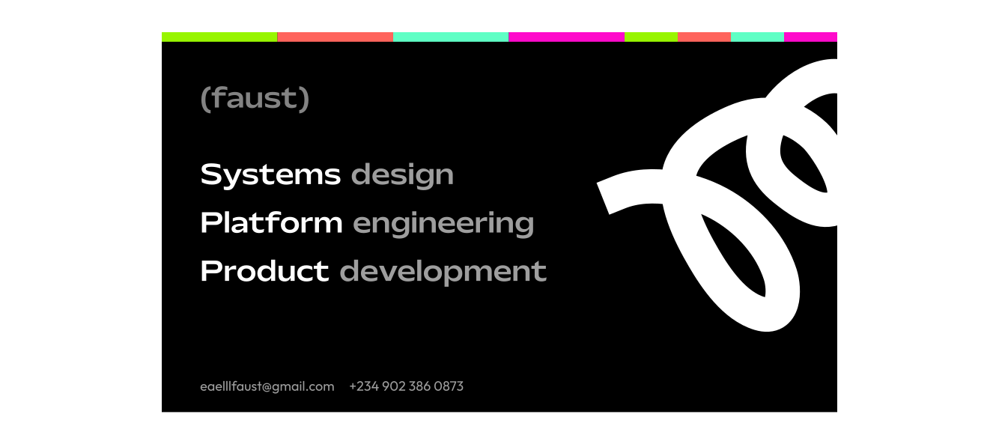

# 🐉 Eaelll Leon Faust 

I'm Leon Faust, an interdisciplinary designer and software engineer.

This is the part where I confess: I have an unhealthy obsession with financial technology products. I love building them, maintaining them, and, of course, breaking them—just so I can fix them right after. Fortune favours the paranoid… and their friends (who would have thought?).

So, what of it? Well, I happen to have founded https://mypursepay.com in 2024, a company committed to growing Nigeria’s wealth economy. A canvas I can paint on and leave any shred of ingenuity that comes of obsession (healthy or unhealthy).

I also run a creative agency https://studio.xenoxforge.com

For the love of design, I'm working on <a target='_blank'>https://theleonfaust.github.io/unlikelyUI/</a>

Wanna know how I think about work? https://hackernoon.com/the-good-work-theory

# Gear

     

          
                                   
          
  

